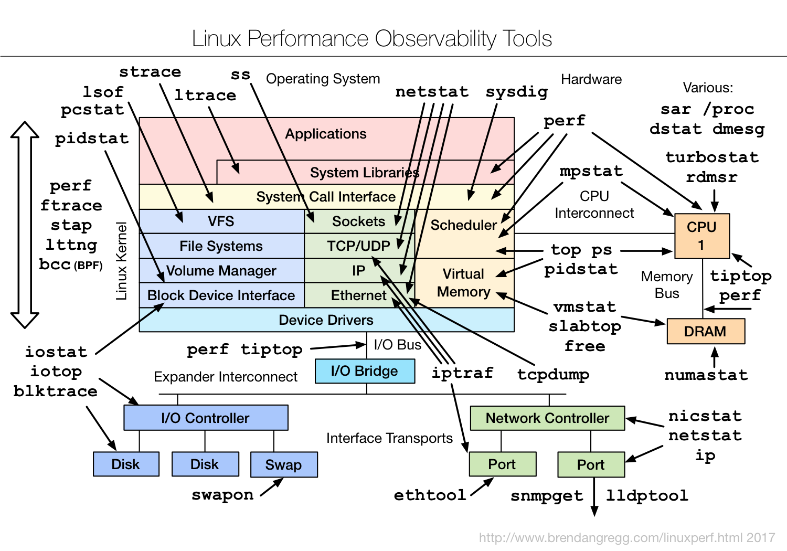

# Site Reliability Engineer Hiring

# At my company

* 2 DC's in different german cities
* ~ 250 VM's in active DC
* second is now used as passive
  * target for 2022 is having multi dc 

# Talk by Andrew Fong 2015

[sre hiring talk](https://www.usenix.org/conference/srecon15/program/presentation/fong)

* Worked at Dropbox
* increased the SRE team from 3 to 30 people

## WHat is SRE about

* Fault Tolerance
  * Self Healing
* Cascading Failures
* Capacity Planning
  * Resources
    * CPU
    * Memory
    * Network
    * Disk
* Disaster Recovery
  * Training
  * Exercise
  * Confidence
* Performance
  * Optimization vs Scaling
  * Guidance When it make sense to optimize and when it doesn't
* Production System
  * Care
  * Mindset

## Why having an SRE Tean


## Hire your first SRE

* define your requirements
  * situation of the company
  * responsibility
  * define the criteria based the maturity of the SRE team 

## Early/Mid SRE organization candidate skills

* **Software Skills**
  * Coding differences towards Software Engineers
    * SRE 
      * building complex system fast but brittle
      * small incremental improvements
      * requirements are kind of stable
    * SWE
      * building more stable complex system slower
      * big incremental improvements
      * requirements are changing quickly
* Systems & Networks
  * **General "Linux" Skills**
    * Provisioning
      * AWS
  * **Low Level System knowledge**
    * capability to explain general concerns about those systems
    * able to verify good from bad low level design
    * propose alternative solutions
  * Dow you know how stuff is put together ?
    * communicate system constraints
* Architecture
  * **Tradeoffs**
    * Able to explain decisions of Tradeoffs
* Troubleshooting (Important)
  * **Logical Thinking**
    * Drill down to find root causes
      * Verify A Then B THen C
  * Depth of knowledge
    * Play Yes/No Terminal (lookup)
    * Identify the level of knowledge in certain areas
      * [How Depth of Knowledge Drives Learning and Assessment](https://www.thoughtco.com/how-depth-of-knowledge-drives-learning-and-assessment-3194253#:~:text=Depth%20of%20knowledge%20(DOK)%20refers,and%20other%20standards%2Ddriven%20evaluation.)
* Soft Skills
  * Customer Service Mentality
    * talk to other teams
    * **collaborate on fixing customer issues and incidents**
* **Prioritization**
  * limited resource and time pick the right work
  * **How to find out in interview ?**

## Hiring stages

### Sourcing

**To be successful only write people you believe fits better in your company then in there current one.**

* Existing employees are your best source of referrals
* Linkedin
* Meetups
* Conferences
* eMail people !

New employees bring new ideas.

#### Pre-Sell

* accept the job offer even before the interview (hardest)
* convince people to attend a interview (hard)

#### Human Connection

* take Notes
* knowing the candidate and what drives him
* how they tick and how you tick (be authentic) !
* 40 hours per week spend in the company 1/3 of each weekday
* does the candidate fits to the current company situation/stages
  * this can change over time
  * keep connection and re asses regularly

### Evaluation (Interview)

#### **Coding**

coding challenge 
* on the whiteboard
* at the laptop (online coding course)
* at home (pre or post interview)

##### Example

```
Build a script that can aggregate status codes over a 1 minute interval for an apache log file in common_log format.
```
Discuss possible constraints and change some of them.
* Systems & Network
  * log files are distributed
  * log files are huge
* **Logical Thinking**
  * What questions came up on the previous constraints ?
    * clearance on the requirements and the given facts
    * What level of detail ?
* **Adapting under pressure**
  * Can they adapt to changes ?
  * How they adapt to it ?
  * Small or big changes lead to changed code or full Refactoring ?
  * **Similarity to on call situation**
* Communication Skills
  * explain certain parts of the code/algorithm in a clear understandable language
  * be patient with repetitive explanation and adjusting the language to the technical level of the listener

### Architecture

Start with a use case.

#### Design a Video Site

Two types of candidates

1) Standard Website Architecture
```
  CDN - Load Balancer
              |
          Web Server
        /            \
     Storage      Database
```
2) Clarify the Requirements (Questions are better ?)
* What is the purpose of this site ?
* What are the monthly uniques ?
* Are we design for UGC (User Generated Content) ?
* Are we design something like Netflix ?
* Is there a sharing model ?
  * How does the sharing model work ?
* Will there need to be ACLs (Access Control Lists) ?

**This questions shape the understanding of which tradeoffs can be made and which not.**

#### Tips

* Average Engineer will over design
  * Simple design and easy adaptable in the future (business changes)
* 

### Troubleshooting

Awesome Refrence [Linux Performance](http://www.brendangregg.com/linuxperf.html)



* How to identify slow responses of different types of servers
  * Database
  * Web Server
* 

## Decision to Hire

* Write down your thoughts
  * check your notes after the Interview
  * evaluate the knowledge part of the interview
    * how deep the candidate showed knowledge if at all ?
    * Good Communication but Zero deep knowledge.
    * ...
  * help later to draw a final conclusion
* Have a rubric that everyone understands
  * Understand your part and job for a group interview
  * *Make this clear before the interview* 
* Don't try and fit someone into a role you didn't evaluate them for
  * setup a new interview for to evaluate the person for this particular role
  * define the role before the interview
* Have an impartial moderator ?
  * hiring manager as a moderator is a bad idea they bias towards hiring
* Ensure there is consensus
  * all interviewer has to agree on the decision
  * disagreement is a fine just be aware of the risk then
* Whats the curve 
  * different acceleration of different candidates
    team needs diversity
    * quick performer
    * longterm performer
    * slow performer


## Tips

* tell the interview the agenda upfront
  * share the over all process
    * discussion
    * coding challenge
    * trouble shooting challenge
* impartial moderator
  * other Engineers/SRE
  * setup the agenda keep the interview rolling
* What/How/Why
  * What is NoSQL ?
  * How NoSQL is used ?
  * Why to use NoSQL ?
* SRE Personal Traits
  * Like to work and touch on everything
    * builds larger, complex more brittle systems
    * less time to market quick and fast
    * technical debt handling
* Evaluate Behavior and Team Skills
* Shadow Interview ???
* Skill vs Attitude
  * Most favor to Attitude and Small Skill
  * Exception Rock Star
    * not to many in the same team
    * Highly Skilled candidate has to be accat
